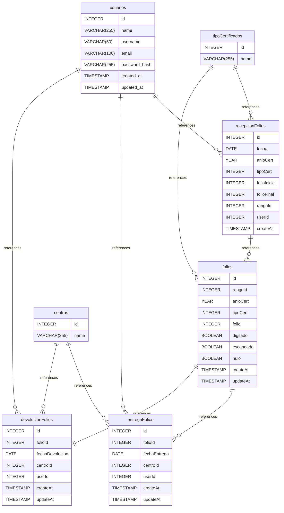

# FoliosDB documentation
## Summary

- [Introduction](#introduction)
- [Database Type](#database-type)
- [Table Structure](#table-structure)
	- [centros](#centros)
	- [tipoCertificados](#tipocertificados)
	- [usuarios](#usuarios)
	- [recepcionFolios](#recepcionfolios)
	- [folios](#folios)
	- [entregaFolios](#entregafolios)
	- [devolucionFolios](#devolucionfolios)
- [Relationships](#relationships)
- [Database Diagram](#database-diagram)

## Introduction

## Database type

- **Database system:** MariaDB
## Table structure

### centros

| Name     | Type         | Settings                       | References                                                  | Note |
| -------- | ------------ | ------------------------------ | ----------------------------------------------------------- | ---- |
| **id**   | INTEGER      | 🔑 PK, not null, autoincrement | fk_centros_id_entregaFolios, fk_centros_id_devolucionFolios |      |
| **name** | VARCHAR(255) | not null                       |                                                             |      | 

### tipoCertificados

| Name     | Type         | Settings                       | References                                                            | Note |
| -------- | ------------ | ------------------------------ | --------------------------------------------------------------------- | ---- |
| **id**   | INTEGER      | 🔑 PK, not null, autoincrement | fk_tipoCertificados_id_recepcionFolios, fk_tipoCertificados_id_folios |      |
| **name** | VARCHAR(255) | not null, unique               |                                                                       |      | 

### usuarios

| Name              | Type         | Settings                             | References                                                                                    | Note |
| ----------------- | ------------ | ------------------------------------ | --------------------------------------------------------------------------------------------- | ---- |
| **id**            | INTEGER      | 🔑 PK, not null, autoincrement       | fk_usuarios_id_recepcionFolios, fk_usuarios_id_entregaFolios, fk_usuarios_id_devolucionFolios |      |
| **name**          | VARCHAR(255) | null                                 |                                                                                               |      |
| **username**      | VARCHAR(50)  | not null, unique                     |                                                                                               |      |
| **email**         | VARCHAR(100) | not null, unique                     |                                                                                               |      |
| **password_hash** | VARCHAR(255) | not null                             |                                                                                               |      |
| **created_at**    | TIMESTAMP    | not null, default: CURRENT_TIMESTAMP |                                                                                               |      |
| **updated_at**    | TIMESTAMP    | not null, default: CURRENT_TIMESTAMP |                                                                                               |      | 

### recepcionFolios

| Name             | Type      | Settings                             | References                        | Note |
| ---------------- | --------- | ------------------------------------ | --------------------------------- | ---- |
| **id**           | INTEGER   | 🔑 PK, not null, autoincrement       |                                   |      |
| **fecha**        | DATE      | not null                             |                                   |      |
| **anioCert**     | YEAR      | not null                             |                                   |      |
| **tipoCert**     | INTEGER   | not null                             |                                   |      |
| **folioInicial** | INTEGER   | not null, unique                     |                                   |      |
| **folioFinal**   | INTEGER   | not null, unique                     |                                   |      |
| **rangoId**      | INTEGER   | not null, unique, autoincrement      | fk_recepcionFolios_rangoId_folios |      |
| **userId**       | INTEGER   | not null                             |                                   |      |
| **createAt**     | TIMESTAMP | not null, default: CURRENT_TIMESTAMP |                                   |      | 

### folios

| Name          | Type      | Settings                             | References                                                | Note |
| ------------- | --------- | ------------------------------------ | --------------------------------------------------------- | ---- |
| **id**        | INTEGER   | 🔑 PK, not null, autoincrement       | fk_folios_id_entregaFolios, fk_folios_id_devolucionFolios |      |
| **rangoId**   | INTEGER   | not null                             |                                                           |      |
| **anioCert**  | YEAR      | not null                             |                                                           |      |
| **tipoCert**  | INTEGER   | not null                             |                                                           |      |
| **folio**     | INTEGER   | not null, unique                     |                                                           |      |
| **digitado**  | BOOLEAN   | not null                             |                                                           |      |
| **escaneado** | BOOLEAN   | not null                             |                                                           |      |
| **nulo**      | BOOLEAN   | not null                             |                                                           |      |
| **createAt**  | TIMESTAMP | not null, default: CURRENT_TIMESTAMP |                                                           |      |
| **updateAt**  | TIMESTAMP | null, default: CURRENT_TIMESTAMP     |                                                           |      | 

### entregaFolios

| Name             | Type      | Settings                             | References | Note |
| ---------------- | --------- | ------------------------------------ | ---------- | ---- |
| **id**           | INTEGER   | 🔑 PK, not null, autoincrement       |            |      |
| **folioId**      | INTEGER   | not null                             |            |      |
| **fechaEntrega** | DATE      | not null                             |            |      |
| **centroId**     | INTEGER   | not null                             |            |      |
| **userId**       | INTEGER   | not null                             |            |      |
| **createAt**     | TIMESTAMP | not null, default: CURRENT_TIMESTAMP |            |      |
| **updateAt**     | TIMESTAMP | not null, default: CURRENT_TIMESTAMP |            |      | 

### devolucionFolios

| Name                | Type      | Settings                             | References | Note |
| ------------------- | --------- | ------------------------------------ | ---------- | ---- |
| **id**              | INTEGER   | 🔑 PK, not null, autoincrement       |            |      |
| **folioId**         | INTEGER   | not null                             |            |      |
| **fechaDevolucion** | DATE      | not null                             |            |      |
| **centroId**        | INTEGER   | not null                             |            |      |
| **userId**          | INTEGER   | not null                             |            |      |
| **createAt**        | TIMESTAMP | not null, default: CURRENT_TIMESTAMP |            |      |
| **updateAt**        | TIMESTAMP | not null, default: CURRENT_TIMESTAMP |            |      | 

## Relationships

- **tipoCertificados to recepcionFolios**: one_to_many
- **usuarios to recepcionFolios**: one_to_many
- **recepcionFolios to folios**: one_to_many
- **tipoCertificados to folios**: one_to_many
- **folios to entregaFolios**: one_to_many
- **centros to entregaFolios**: one_to_many
- **usuarios to entregaFolios**: one_to_many
- **usuarios to devolucionFolios**: one_to_many
- **folios to devolucionFolios**: one_to_one
- **centros to devolucionFolios**: one_to_many

## Database Diagram

